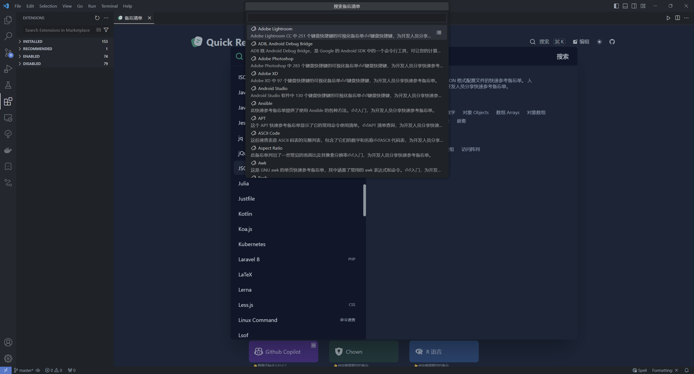
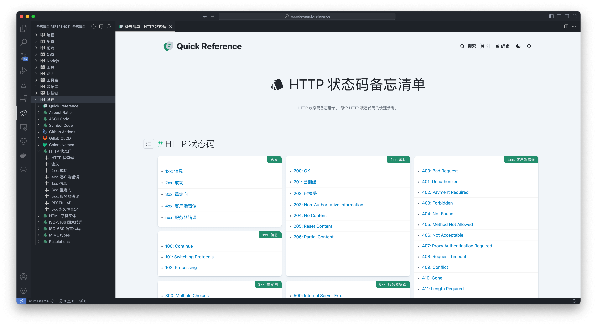

# Quick Reference for VSCode
Reference 是一组由开源社区贡献的备忘单集合，为开发者提供了精美的布局和快速参考信息

## 使用方法
- 在 VSCode [扩展市场](https://marketplace.visualstudio.com/items?itemName=jackiotyu.quick-reference)中安装
- 打开vscode命令面板搜索
    - `打开备忘清单(Open Reference)📚`
    - `搜索备忘清单(Search in Reference)🔍`

## 原始仓库
[reference](https://github.com/jaywcjlove/reference)