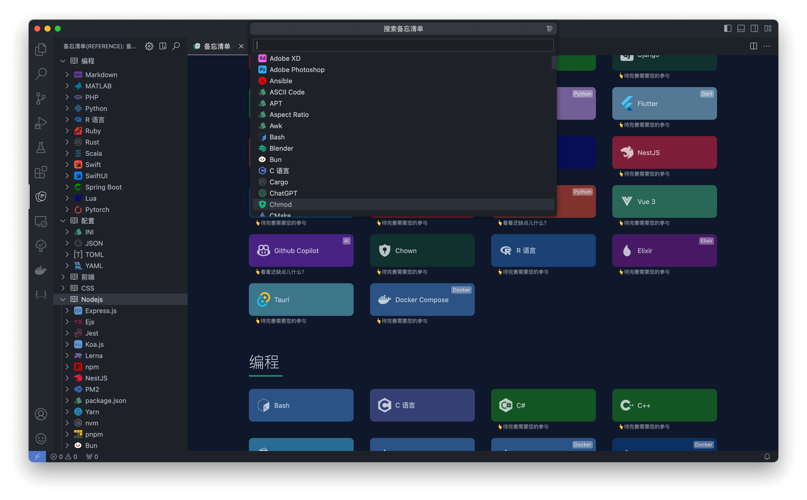

# Quick Reference for VSCode
为开发人员分享快速参考备忘清单(速查表)🚀

## 使用方法
打开vscode命令面板搜索
- `打开备忘清单(Open Quick Reference)📚`
- `搜索备忘清单(Search in Quick Reference)🔍`

## 原始仓库
[reference](https://github.com/jaywcjlove/reference)